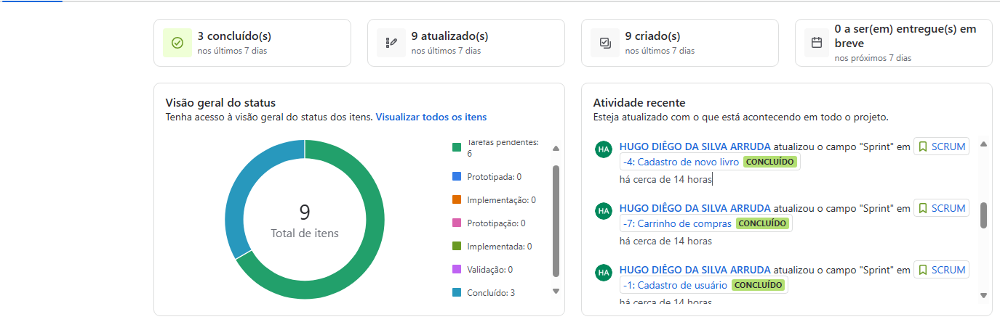
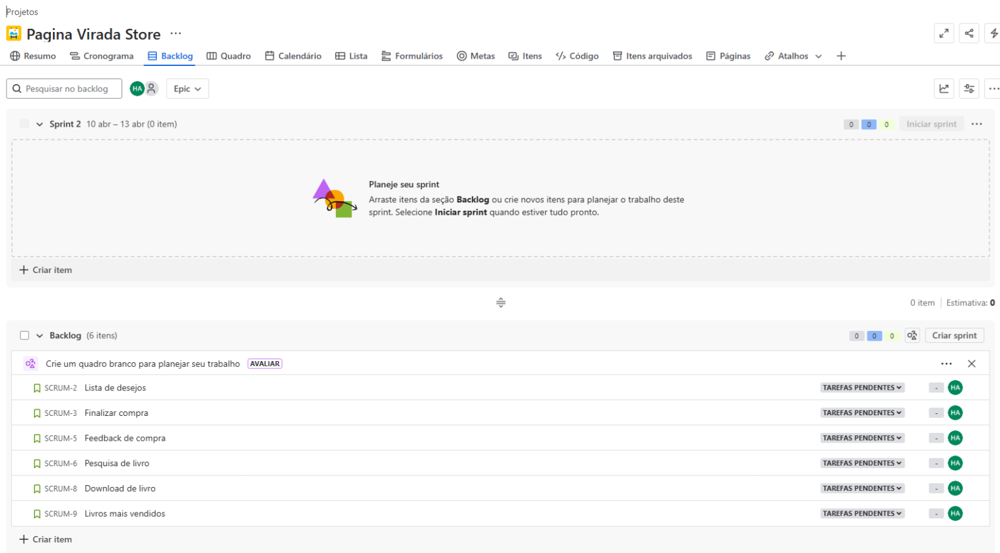
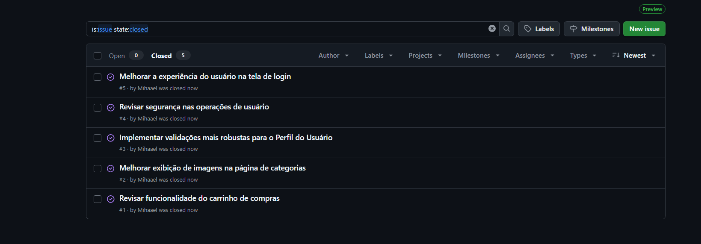

# 📚 Página Virada Store

## 📌 Sobre o Projeto

**Página Virada Store** é um e-commerce especializado na venda de livros e e-books. O projeto tem como objetivo proporcionar uma experiência intuitiva e acessível para os usuários adquirirem seus títulos favoritos de forma rápida e segura.

## 🚀 Funcionalidades Implementadas

### 📝 Cadastro de Usuário
- Permite que novos usuários criem uma conta na plataforma.
- Validação de dados no momento do cadastro.
- Armazenamento seguro das informações no banco de dados.

### 🛒 Carrinho de Compras
- Usuários podem adicionar e remover livros do carrinho.
- Cálculo do valor total da compra.
- Possibilidade de finalizar a compra.

### 📖 Cadastro de Livros
- Permite que administradores cadastrem novos livros no catálogo.
- Inclui informações como título, autor, descrição e preço.
- Geração automática de identificação para cada livro.

## 👥 Equipe de Desenvolvimento

| Nome                         | E-mail                         |
|-----------------------------|--------------------------------|
| Guilherme Rapela Medeiros   | grm2@cesar.school              |
| Hugo Diêgo Da Silva Arruda  | hdsa@cesar.school              |
| João Guilherme Omena        | jgbof@cesar.school             |
| José Vitor Gomes Veloso     | jvgv@cesar.school              |
| Lucas Samuel Pereira Alves  | lspa@cesar.school              |
| Rafael Lyra Costa           | rlc3@cesar.school              |

---

## 🔗 Links do Projeto

- 🎨 **Figma**: [Protótipo](https://www.figma.com/design/aDKjwqFzzYOgslpmmFgf3w/Untitled?node-id=0-1&t=petcbihtWxGSNXbQ-1)
- 🎥 **Vídeo 1**: [Demonstração](https://youtu.be/muRVmqQawBw)
- 🎥 **Vídeo 2**: [Demonstração](https://youtu.be/kaBcxNm3d-Y)
- 📄 **Histórias do Usuário**: [Documentação](https://docs.google.com/document/d/1qxWeY8sgxpPxejGPDY0ZJitrgwIRGgKHSkECFL7OSgg/edit?usp=sharing)
- 📌 **Jira**: [Gerenciamento do Projeto](https://paginaviradastore.atlassian.net/jira/software/projects/SCRUM/summary)
- 📌 **Azure**: [Projeto](paginaviradastore-g8fjeqbuc9beeuc3.brazilsouth-01.azurewebsites.net)

## 📦 Entregas

### 🚀 Entrega 1

### 🚀 Entrega 2

Link azure: paginaviradastore-g8fjeqbuc9beeuc3.brazilsouth-01.azurewebsites.net 

#### 💬 Relato Programação em Par
Tentamos utilizar o metodo de programação em par, porém, com resultados abaixo da expectativa e que não agregaram suficientemente para com o projeto. 

Dessa forma, optamos por não utilizar o modelo de programação em par em nosso projeto, principalmente devido à dificuldade de conciliar os horários dos integrantes do grupo. Muitas vezes, não era possível reunir todos ao mesmo tempo, o que tornava inviável manter sessões contínuas de codificação conjunta.

Em vez disso, adotamos uma abordagem mais flexível: realizamos reuniões no Discord com os membros disponíveis no momento para discutir o andamento do projeto e definir os próximos passos. A partir dessas conversas, cada integrante ficou responsável por desenvolver partes específicas do sistema, contribuindo de forma colaborativa, ainda que em momentos diferentes.

Essa estratégia nos permitiu manter o ritmo de trabalho, respeitar os prazos e garantir a qualidade do projeto, mesmo sem seguir o modelo tradicional de programação em par.

### 🚧 Entrega 3
*(em andamento)*

### 🚧 Entrega 4
*(em andamento)*

## 💡 Observações
> Este projeto é parte da disciplina de Fundamentos de Desenvolvimento de Software (FDS) – 2025.1.
