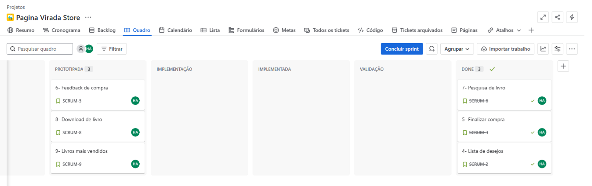
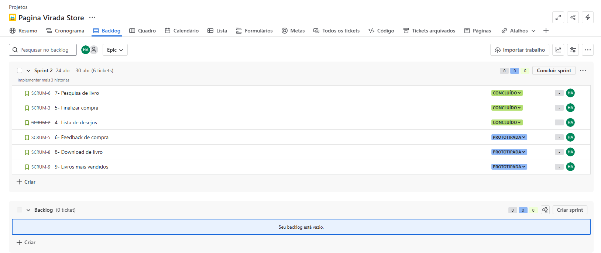
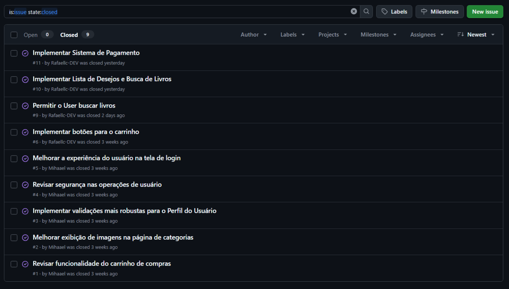

# 📚 Página Virada Store

**Página Virada Store** é um e-commerce especializado na venda de livros e e-books. O projeto tem como objetivo proporcionar uma experiência intuitiva e acessível para os usuários adquirirem seus títulos favoritos de forma rápida e segura.

## 🔨 Ferramentas

  
  
  
  
  

 

## 🛠️ Funcionalidades

### 👤 Usuário
- Cadastro e login com validação.
- Carrinho de compras funcional.
- Lista de desejos.
- Busca por livros.
- Pagamento simulado com feedback de compra.

### 🔒 Administrador
- Cadastro e gerenciamento de livros.
- Gerenciamento de pedidos e seus status.

 

## 🤝 Equipe
<table>
  <tr>
    <td align="center">
      <b>Guilherme Rapela Medeiros</b> grm2@cesar.school
    </td>
    <td align="center">
      <b>Hugo Diêgo Da Silva Arruda</b> hdsa@cesar.school
    </td>
    <td align="center">
      <b>João Guilherme Omena</b> jgbof@cesar.school
    </td>
    <td align="center">
      <b>José Vitor Gomes Veloso</b> jvgv@cesar.school
    </td>
    <td align="center">
      <b>Lucas Samuel Pereira Alves</b> lspa@cesar.school
    </td>
    <td align="center">
      <b>Rafael Lyra Costa</b> rlc3@cesar.school
    </td>
  </tr>
</table>

## 📦 Entregas

🚀 Entrega 1

 

### 📄 Jira Board 

### 📄 Jira Backlog

 

  
  
  

 

🚀 Entrega 2

 

### 📄 Jira Board 
  
 

### 📄 Jira Backlog
  
 

### 📌 Issues 

 

  
  
  

 

🚀 Entrega 3

 

### 📄 Jira Board 

 

### 📄 Jira Backlog

 

### 📌 Issues 

 

#### 💬 Relato Programação em Par
  Dando continuidade à estratégia definida na Sprint 1, mantivemos a divisão de tarefas entre os membros do grupo com base em reuniões pontuais realizadas no Discord. Essa abordagem, mais flexível e adaptada à nossa rotina, seguiu sendo eficaz ao permitir que cada integrante contribuísse com partes específicas do projeto de forma assíncrona.

  Apesar de termos considerado a possibilidade de retomar a programação em par, concluímos que, devido às limitações de disponibilidade simultânea dos integrantes, o modelo ainda não é viável para o grupo neste momento. A colaboração tem ocorrido de maneira produtiva através de alinhamentos regulares, trocas de feedbacks e suporte mútuo durante o desenvolvimento.

  Essa forma de organização tem favorecido a fluidez do trabalho, o cumprimento dos prazos e a qualidade das entregas previstas para esta sprint.

  
  
  
  
  
  
  

 

🚧 Entrega 4

 

*(Em andamento)*

---

## 💡 Observações

> Este projeto é parte da disciplina de Fundamentos de Desenvolvimento de Software (FDS) – 2025.1.
