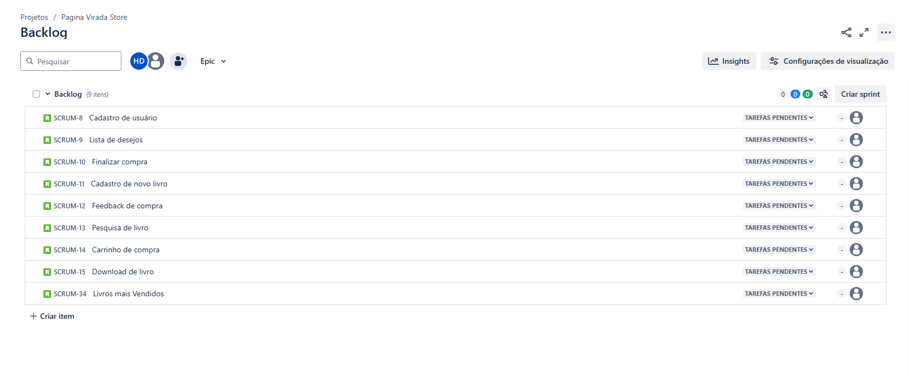

# 📚 Página Virada Store

## 📌 Sobre o Projeto

**Página Virada Store** é um e-commerce especializado na venda de livros e e-books. O projeto tem como objetivo proporcionar uma experiência intuitiva e acessível para os usuários adquirirem seus títulos favoritos de forma rápida e segura.

## 🚀 Funcionalidades Implementadas

### 📝 Cadastro de Usuário
- Permite que novos usuários criem uma conta na plataforma.
- Validação de dados no momento do cadastro.
- Armazenamento seguro das informações no banco de dados.

### 🛒 Carrinho de Compras
- Usuários podem adicionar e remover livros do carrinho.
- Cálculo do valor total da compra.
- Possibilidade de finalizar a compra.

### 📖 Cadastro de Livros
- Permite que administradores cadastrem novos livros no catálogo.
- Inclui informações como título, autor, descrição e preço.
- Geração automática de identificação para cada livro.

## 👥 Equipe

- **Guilherme Rapela Medeiros** - grm2@cesar.school
- **Hugo Diêgo Da Silva Arruda** - hdsa@cesar.school
- **João Guilherme Almeida** - jgbof@cesar.school
- **José Vitor Gomes Veloso** - jvgv@cesar.school
- **Lucas Samuel Pereira Alves** - lspa@cesar.school
- **Rafael Lyra Costa** - rlc3@cesar.school

## 🔗 Links do Projeto

- 🎨 **Figma**: [Protótipo](https://www.figma.com/design/aDKjwqFzzYOgslpmmFgf3w/Untitled?node-id=0-1&t=petcbihtWxGSNXbQ-1)
- 🎥 **Vídeo**: [Demonstração](https://youtu.be/muRVmqQawBw)
- 📄 **Histórias do Usuário**: [Documentação](https://docs.google.com/document/d/1qxWeY8sgxpPxejGPDY0ZJitrgwIRGgKHSkECFL7OSgg/edit?usp=sharing)
- 📌 **Jira**: [Gerenciamento do Projeto](https://paginaviradastore.atlassian.net/jira/software/projects/SCRUM/summary)

## 📦 Entregas

### 🚀 Entrega 1

### 🚀 Entrega 2

### 🚀 Entrega 3

### 🚀 Entrega 4